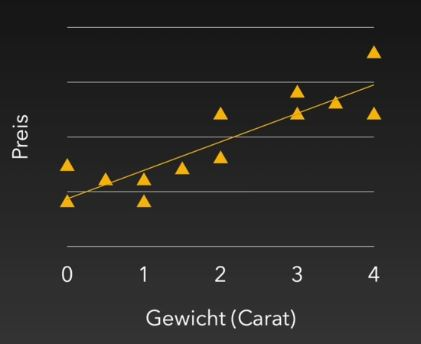
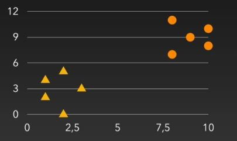
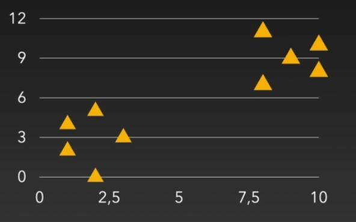

## Data Science / Machine Learning / Deep Learning / AI

Grundlagen:
- Numpy
- Pandas
- Visualisierung von Daten

Was ist Machine Learning überhaupt?

Im Normalfall hat man **Daten** (Exceltabelle, CSV-Datei, Bild, ...) als Ausgangsbasis.
Danach entwickelt man ein **Modell** mithilfe von Machine Leraning oder Deep Learning.
Dieses Modell ist dann in der Lage auf neuen Daten **Vorhersagen** zu machen

Beispiel: 
Man könnte auf Basis von existierenden Patientendaten (Datenbasis) ein Modell trainieren welches vorhersagen kann
ob ein Patient Brustkrebs oder Diabetes entwickelt oder nicht. Mit eigenen Daten könnte man danach eine Vorhersage
bekommen ob dieser Patient Brustkrebs oder Diabetes entwickelt oder nicht.

Im Machine Learning gibt es verschiedene **Bereiche**:
- Regression
- Klassifizierung
- Clustering
- Dimensionsreduktion
- Natural Language Processing
- Reinforcement Leraning
- Neuronale Netze / Deep Learning (eher eine Methodik als ein Bereich)

### Regression

Hier wird eine stetige Variable (Kommazahl, jeder beliebige Wert) vorhergesagt (z.B. der Preis von einem Diamanten, ...)

Beispiele:
- Preis eines Autos
- Umsatz eines Unternehmens
- Entwicklung einer Aktie
- Gehalt eines Mitarbeiters
- Wie viele Euro können wir für einen Klick auf diese Anzeige bieten?
- Nenne weitere Beispiele???

### Klassifizierung

Gegeben:
- Markierte Daten
- Wir möchten die Markierung vorhersagen

wenn dann die Datenpunkte in einem bestimmten Bereich fallen kann man daraus auf die Datenklassifizierung schließen

Beispiele: 

- Brustkrebs: Ja / Nein
- Email: Spam / Nicht-Spam
- Bilderkennung (ist auf diesem Bild ein Auto zu sehen?)
- Welche Ziffer ist auf einem Bild zu sehen? - Klassifizierung mit mehreren Klassen (Ausgängen)

### Clustering

Gegeben:
- Unmarkierte Daten
- Wir möchten die Daten in Gruppen aufteilen

Beispiele:
- Ein Soziales Netzwerk möchte die Benutzer nach Interessen (von vornherein nicht gegeben) gruppieren (Werbung). Benutzer in Gruppen aufteilen - die Gruppen stehen im vorhinein nicht fest
- Bilder nach Farbe gruppieren
- Segmentierung der Produkte in einem Online-Shop (man kennt die Gruppen im vorhinein nicht)

### Natural Language Processing

Informationen werden aus einem Text extrahiert. Ist eher eine Methodik. Kommt immer dann zum Tragen wenn ein Fließtext verarbeitet werden muss.

Beispiele:
- E-Mail-Adressen aus Text extrahieren
- Bedeutung von Adjektiven (Eigenschaftswörter) erlernen (positive / negativ) - mit Klassifizierung
- Fragen zu einem Text beantworten

### Reinforcement Learning

Bedeutet, dass sich der Computer selbst etwas beibringt

Beispiel:
- Der Computer spielt "Flappy Bird", und lernt, wann er springen muss
- Der Computer spielt "Tetris" gegen sich selbst
- Oder League of Legends

### Neuronale Netze / Deep Learning

Ist ein Unterbegriff von Machine Learning (ein Teil von ML) mit einem Fokus auf Neuronale Netze
- Beschreiben keinen Problemtyp, sondern eine Herangehensweise (spezielle Art eines Modells)
- Ein Neuronals Netz ist also eine Möglichkeit, um ein Klassifizierungs-Problem zu lösen (auch eine Möglichkeit ein Regressionsproblem zu lösen)
- performen sehr gut bei Bilderkennungsproblemen
- als Modell relativ komplex (viele Gewichte, ...)
- bauen auf Machine Learning auf
- wenn klassisches Machine Learning ausreicht ist dieses oft zu bevorzugen (z.B. Diabeteserkennung - die Nachvollziehbarkeit warum z.B. Diabetes erkannt wurde ist viel leichter) - gerade bei wenigen Daten

Vorteil:
- Wir können damit oft komplexere Probleme greifen
Nachteil:
- Das Modell wird eine Art "Black-Box"
