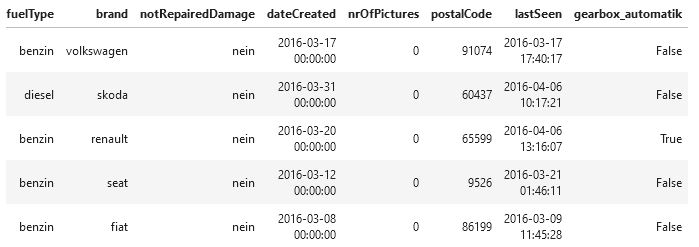

## Vorstellung der Daten

Basis ist die Datei **autos.csv.bz2**

```python
import numpy as np
import seaborn as sns
import pandas as pd

#df = pd.read_csv("../data/Autos/autos.csv.bz2") # UnicodeDecodeError
df = pd.read_csv("../data/Autos/autos.csv.bz2", encoding = "iso-8859-1")

# Filterungen
df = df[df["offerType"] == "Angebot"]
df = df[df["vehicleType"] == "kleinwagen"]
df = df[df["notRepairedDamage"] == "nein"]

# alle Datensätze entfernen wo ein nan enthalten ist
df.dropna(inplace = True)

df.head()
```


## Erstes Modell trainieren

Ein Modell entwickeln, welches auf Basis des Kilometerstandes und/oder der Erstzulassung einen Preis bestimmt

Grunddaten:
```python
import numpy as np
import seaborn as sns
import pandas as pd

df = pd.read_csv("../data/Autos/autos.csv.bz2", encoding="iso-8859-1")
df.head()
```

Die notwendigen Daten:
```python
from sklearn.model_selection import train_test_split

X = df[["kilometer", "yearOfRegistration"]]
y = df["price"]

X_train, X_test, y_train, y_test = train_test_split(X, y, train_size = 0.75)

#print(X_train.shape)
#(278646, 2)
#print(X_test.shape)
#(92882, 2)
```

Das Modell trainieren:
```python
from sklearn.linear_model import LinearRegression

model = LinearRegression()
model.fit(X_train, y_train)

print(model.score(X_test, y_test))
print(model.score(X_train, y_train))

-9.778681297811787e-05 --> R2 nahe der 0 -> Modell nicht gut
2.6837773903221063e-07 --> R2 nahe der 0 -> Modell nicht gut
```
bei beiden Datensätzen kommt ein Wert nahe der Null -> es kann etwas mit den Daten nicht stimmen

Auch wenn man nur die Kilometerdaten (X = df[["kilometer"]]) als Basis nimmt, kommt ein schlechter Score heraus

Woran könnte dies liegen -> z.B. daran, dass die Daten nicht bereinigt sind

```python
sns.distplot(df["kilometer"], kde = False)
```


Die Daten auf bestimmte Werte filtern - **Vorfilterung!!!** (in der Praxis ein ganz wichtiger Punkt):
```python
df = df[df["offerType"] == "Angebot"]
df = df[df["vehicleType"] == "kleinwagen"]
df = df[df["notRepairedDamage"] == "nein"]

df.dropna(inplace = True)
```

```python
from sklearn.linear_model import LinearRegression
from sklearn.model_selection import train_test_split

X = df[["kilometer"]]
y = df["price"]

X_train, X_test, y_train, y_test = train_test_split(X, y, train_size = 0.75)

model = LinearRegression(normalize = True)
model.fit(X_train, y_train)

print(model.score(X_train, y_train))
print(model.score(X_test, y_test))

0.3974480378158128
0.378525946319768
```

Mit den Registrierungsdaten wird der Score noch besser
```python
from sklearn.linear_model import LinearRegression
from sklearn.model_selection import train_test_split

X = df[["kilometer", "yearOfRegistration"]]
y = df["price"]

X_train, X_test, y_train, y_test = train_test_split(X, y, train_size = 0.75)

model = LinearRegression(normalize = True)
model.fit(X_train, y_train)

print(model.score(X_train, y_train))
print(model.score(X_test, y_test))

0.5500954416309312
0.5295750731897872
```

Wie bekommt man nun die Schätzwerte (für mehrere Daten auf einmal möglich)
```python
X_pred = np.array([
    [150000, 2000],
    [100000, 1998]
])

print(model.predict(X_pred))

[1329.17420452 2279.06299304]
```

## One-Hot-Encoding (eine Spalte)

In diesem Abschnitt geht es darum wie man mit kategorischen Features umgeht. Es geht weiterhin um ein Regressionsproblem (z.B. den Preis eines Autos mithilfe eines Modells vorherzusagen).<br>
Bisher waren es immer numerische Features (z.B. Anmeldejahr, Kilometerstand, ...)

In diesem Abschnitt geht es darum ein weiteres Feature einfließen zu lassen - ob das Auto ein Automatikgetriebe (gearbox) hat oder nicht.


```python
import numpy as np
import seaborn as sns
import pandas as pd

df = pd.read_csv("../data/Autos/autos.csv.bz2", encoding = "iso-8859-1")

df = df[df["offerType"] == "Angebot"]
df = df[df["vehicleType"] == "kleinwagen"]
df = df[df["notRepairedDamage"] == "nein"]

df.dropna(inplace = True)

df.head()
```
```python
from sklearn.linear_model import LinearRegression
from sklearn.model_selection import train_test_split

X = df[["kilometer", "yearOfRegistration", "gearbox"]]
y = df["price"]

X_train, X_test, y_train, y_test = train_test_split(X, y, train_size = 0.75)

model = LinearRegression(normalize = True)
model.fit(X_train, y_train)

print(model.score(X_train, y_train))
print(model.score(X_test, y_test))
```
--> dies ergibt einen ValueError (could not convert string to float: 'manuell')

Die lineare Regression kann vorerst nur numerische Werte in der fit-Funktion verarbeiten

```python
# einmal alle Werte anzeigen lassen
# df["gearbox"]
df["gearbox"].unique()

array(['manuell', 'automatik'], dtype=object)
```

Vorerst betrachten wir nur Spalten die nur 2 verschiedene Werte haben. Später auch mit mehreren Werten.

Wir erstellen eine neue Spalte (gearbox_automatik) mit einem Vergleich. Dies liefert eine Series mit True oder False Werten
```python
df["gearbox_automatik"] = df["gearbox"] == "automatik"

df.head()
```


Diese neue Spalte kann problemlos in eine neue Berechnung (Lineare Regression) aufgenommen werden, denn True und False werden in ein 0 und eine 1 umgewandelt.

```python
from sklearn.model_selection import train_test_split
from sklearn.linear_model import LinearRegression

X = df[["kilometer", "yearOfRegistration", "gearbox_automatik"]]
y = df["price"]

X_train, X_test, y_train, y_test = train_test_split(X, y, train_size = 0.75)

model = LinearRegression(normalize = True)
model.fit(X_train, y_train)

print(model.score(X_train, y_train))
print(model.score(X_test, y_test))

0.5508531734382349
0.5327418929583881
```
Man bekommt eingentlich keinen sehr viel besseren Score.

Für Vorhersagen muss man jetzt natürlich 3 Parameter übergeben.

```python
X_pred = np.array([
    [150000, 2000, 1],
    [150000, 2000, 0]
])

print(model.predict(X_pred))

[1818.2150662 1292.077788 ]
```

## One-Hot-Encoding (mehrere Spalten)

Mit dem Einfließen der Automarke (brand) wird sich das Bestimmtheitsmaß massiv verbessern.

```python
import numpy as np
import seaborn as sns
import pandas as pd

df = pd.read_csv("../data/Autos/autos.csv.bz2", encoding = "iso-8859-1")

df = df[df["offerType"] == "Angebot"]
df = df[df["vehicleType"] == "kleinwagen"]
df = df[df["notRepairedDamage"] == "nein"]

df.dropna(inplace = True)
```

```python
df["brand"].unique()

# df["brand_volkswagen"]

array(['volkswagen', 'skoda', 'renault', 'seat', 'fiat', 'ford', 'nissan',
       'audi', 'mercedes_benz', 'honda', 'peugeot', 'opel', 'smart',
       'kia', 'daihatsu', 'citroen', 'hyundai', 'mini', 'mitsubishi',
       'suzuki', 'bmw', 'lancia', 'daewoo', 'toyota', 'mazda',
       'chevrolet', 'dacia', 'alfa_romeo', 'subaru', 'trabant', 'rover',
       'chrysler', 'lada', 'volvo'], dtype=object)
```
Durch die unique-Funktion bekommt man die verschiedenen Werte. Diese Werte muss man jetzt in separate Spalten umwandeln (z.B. "brand_volkswagen")

Aber wie wandelt man jetzt diese verschiedenen Werte in einzelne Spalten um (--> es gibt eine fertige Funktion in sklearn - OneHotEncoder)

> **Lösung: OneHotEncoder!**

```python
from sklearn.preprocessing import OneHotEncoder

X = np.array([
    ["volkswagen"],
    ["skoda"],
    ["volkswagen"],
    ["volkswagen"],
    ["skoda"]
])

oh = OneHotEncoder()
oh.fit(X)

print(oh.categories_)

#print(oh.transform(X))     # Ausgabe ist ein Sparse-Array (ist ein speicheroptimiertes Array)
                            # man kann aber auf einzelne Werte mit print(oh.transform(X)[0, 0]) zugreifen

print(oh.transform(X).toarray())

[array(['skoda', 'volkswagen'], dtype='<U10')]
[[0. 1.]
 [1. 0.]
 [0. 1.]
 [0. 1.]
 [1. 0.]]
```

```python
from sklearn.preprocessing import OneHotEncoder

X = df[["kilometer", "yearOfRegistration", "brand"]]
X.head()
```


Man darf den OneHotEncoder nur auf die Spalte "brand" loslassen - darfür gibt es die Funktion **ColumnTransformer**

```python
from sklearn.preprocessing import OneHotEncoder
from sklearn.compose import ColumnTransformer

X = df[["kilometer", "yearOfRegistration", "brand"]]

cf = ColumnTransformer([
    ("brand", OneHotEncoder(), ["brand"])
], remainder = "passthrough")
# Zuerst ein Name ("brand") - kann ein beliebiger Namen sein
# dann die Funktion (OneHotEncoder())
# und danach die Spalte auf die der OneHotEncoder angewendet werden soll ("brand")
# standardmäßig werden alle anderen Spalten gelöscht - durch den Parameter **remainder = "passthrough"** bleiben diese erhalten

# ausführen der Transformation
cf.fit(X)

#print(cf.transform(X)) # Ausgabe einer Sparse-Metrix
#print(cf.transform(X).toarray())
print(cf.transform(X).toarray().shape)

(51521, 36)
```

Neue X-Daten
```python
X_transformed = cf.transform(X)
```

Damit ergibt sich schon ein viel besserer Score
```python
from sklearn.model_selection import train_test_split
from sklearn.linear_model import LinearRegression

y = df["price"]

X_train, X_test, y_train, y_test = train_test_split(X_transformed, y, train_size = 0.75)

model = LinearRegression()
model.fit(X_train, y_train)

print(model.score(X_train, y_train))
print(model.score(X_test, y_test))

0.6657187549399992
0.6517587569607417
```

## Modell und One-Hot-Encoding

Dabei geht es darum die Daten ein wenig zu interpredieren

```python
import numpy as np
import seaborn as sns
import pandas as pd

df = pd.read_csv("../data/Autos/autos.csv.bz2", encoding = "iso-8859-1")

df = df[df["offerType"] == "Angebot"]
df = df[df["vehicleType"] == "kleinwagen"]
df = df[df["notRepairedDamage"] == "nein"]

df.dropna(inplace = True)

df.head()
```

ColumnTransformer: [https://scikit-learn.org/stable/modules/generated/sklearn.compose.ColumnTransformer.html](https://scikit-learn.org/stable/modules/generated/sklearn.compose.ColumnTransformer.html)

OneHotEncoder: [https://scikit-learn.org/stable/modules/generated/sklearn.preprocessing.OneHotEncoder.html](https://scikit-learn.org/stable/modules/generated/sklearn.preprocessing.OneHotEncoder.html)

```python
from sklearn.preprocessing import OneHotEncoder
from sklearn.compose import ColumnTransformer

X = df[["kilometer", "yearOfRegistration", "brand"]]

cf = ColumnTransformer([
    ("brand", OneHotEncoder(), ["brand"])
], remainder = "passthrough")

cf.fit(X)

X_transformed = cf.transform(X)
```
X_transformed ist eine Sparse Matrix mit 36 Spalten und 51521 Zeilen
```python
X_transformed
```

```python
X_transformed.toarray()
```


Wie kommen wir jetzt an den OneHotEncoder?

Der OneHotEncoder ist im ColumnTransformer versteckt (siehe Dokumentation die Eigenschaft **named_transformers_**). Und damit kann man dann auf die fitted-Transformers (z.B. OneHotEncoder) zugreifen. Man kann dann auf die Eigenschaft named_transformers_ zugreifen.

```python
cf.named_transformers_

{'brand': OneHotEncoder(), 'remainder': 'passthrough'}
```
```python
cf.named_transformers_['brand']

OneHotEncoder()
```

Aus diesem OneHotEncoder kann man dann die einzelnen Kategorien (Spalten) auslesen
```python
cf.named_transformers_['brand'].categories_

[array(['alfa_romeo', 'audi', 'bmw', 'chevrolet', 'chrysler', 'citroen',
        'dacia', 'daewoo', 'daihatsu', 'fiat', 'ford', 'honda', 'hyundai',
        'kia', 'lada', 'lancia', 'mazda', 'mercedes_benz', 'mini',
        'mitsubishi', 'nissan', 'opel', 'peugeot', 'renault', 'rover',
        'seat', 'skoda', 'smart', 'subaru', 'suzuki', 'toyota', 'trabant',
        'volkswagen', 'volvo'], dtype=object)]
```

Wichtig ist das der ColumnTransformer auf die Daten angewendet wird und auf das Ergebnis der transformierten Daten danach die lineare Regression angewendet wird.

```python
from sklearn.model_selection import train_test_split
from sklearn.linear_model import LinearRegression

y = df["price"]

X_train, X_test, y_train, y_test = train_test_split(X_transformed, y, train_size = 0.75)

model = LinearRegression()
model.fit(X_train, y_train)

print(model.score(X_train, y_train))
print(model.score(X_test, y_test))

0.6668619381360524
0.6492516299683396
```

Wie kann man danach ein bestimmtes Auto schätzen? Es können natürlich nur Autos (df["brand"].unique()) geschätzt werden die entsprechend aus der Transformation entstanden sind.

```python
X_pred = pd.DataFrame([
    [150000, 2000, "audi"],
    [150000, 2000, "bmw"]
], columns = ["kilometer", "yearOfRegistration", "brand"])

X_pred
```


Es funktioniert nicht die Daten direkt zu verarbeiten
```python
model.predict(X_pred)

#ValueError
```
Die daten müssen zuerst immer durch den ColumnTransformer durchlaufen und erst diese Ausgaben können für die Schätzung herangezogen werden.
```python
model.predict(cf.transform(X_pred))

array([5820.40779946, 4079.02961403])
```
cf.transform auf die X_pred Daten liefert eine 2x36 sparse Matrix
```python
cf.transform(X_pred)

<2x36 sparse matrix of type '<class 'numpy.float64'>'
	with 6 stored elements in Compressed Sparse Row format>
```

## Weitere Hinweise: One-Hot-Encoding

Beim OneHotEncoding werden neue (viele) Spalten erzeugt. Bei zu vielen Spalten wird es für die lineare Regression schwierig die Daten zu greifen. Bei der linearen Regression funktioniert dies meist noch, aber es gibt Modelle, wo die Anzahl der Spalten sehr stark in die Performance eingeht.

Sinn macht nach den häufigsten Spalten zu filtern:
```python
# df.groupby("brand").agg(c = ("brand", len))
# df = df[(df["brand"] == "audi") | (df["brand"] == "bmw") | (df["brand"] == "skoda")]
```
