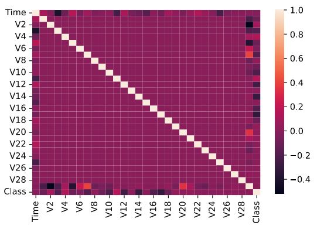
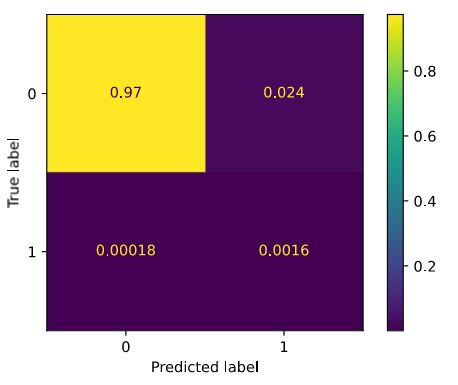

## Einführung: Kreditkartendaten

Echte Daten sind sehr schwer zu bekommen, daher wurden die Daten mittels PCA anonymisiert<br>
-> es ergeben sich 21 Spalten in denen iregndwie die Daten (z.B. Alter, Postleitzahl, durchschnittliche Einkommen, ...) versteckt sind

```python
# Matplotlib config
%matplotlib inline
%config InlineBackend.figure_formats = ['svg']
%config InlineBackend.rc = {'figure.figsize': (5.0, 4.0)}

import pandas as pd
import numpy as np
import seaborn as sns

df = pd.read_csv("../data/CreditCard/creditcard.csv.bz2")
df.head()
```

Auch die Zeitspalte wurde anonymisiert. Die Spalte **Amount** zeigt den Transaktionsbetrag und die Spalte **Class** gibt an ob es eine korrekte Kreditkartentransaktion war oder ob es ein Kreditkartenbetrug war.

Wir wollen die Spalte Class vorhersagen

```python
df.groupby("Class").agg(l = ("Time", len))

 	   l
Class 	
0 	284315.0
1 	492.0
```
Nur ungefähr 492 Daten werden als Kreditkartenbetrug eingestuft --> die beiden Klassen (0 - kein Betrug, 1 - Betrug) sind sehr stark unbalanced (nicht ausgeglichen) -> muss beim Trainieren beachtet werden.

Man hat eigentlich kein Gefühl aus den Daten von welchen Paramatern der Betrug abhängig ist. Der einzige Parameter welcher vorerst in betracht kommt ist der Transaktionsbetrag (Amount). Man könnte jetzt versuchen einmal aus der Größe von Amount einen Zusammenhang zu finden.

```python
df.groupby("Class").agg(avgAmount = ("Amount", np.mean))

 	   avgAmount
Class 	
0 	88.291022
1 	122.211321
```
Es gibt einen kleinen Zusammenhang - je höher der Betrag, desto wahrscheinlicher der Betrug

Über die corr-Funktion kann man jetzt einmal einen Zusammenhang ermitteln. Je näher der Wert an 1 ist, desto höher ist die Korrelation mit der anderen Spalte
```python
#df.corr()
sns.heatmap(df.corr());
```


## Daten analysieren

Wir holen uns einmal von der Spalte Class die Korrelationen
```python
df.corr()["Class"]

Time     -0.012323
V1       -0.101347
V2        0.091289
V3       -0.192961
V4        0.133447
V5       -0.094974
V6       -0.043643
V7       -0.187257
V8        0.019875
...
```

Uns interessieren aber nur die absoluten Werte sortiert
```python
df.corr()["Class"].abs().sort_values()

...
V18       0.111485
V4        0.133447
V11       0.154876
V7        0.187257
V3        0.192961
V16       0.196539
V10       0.216883
V12       0.260593
V14       0.302544
V17       0.326481
Class     1.000000
Name: Class, dtype: float64
```

Modell bauen (mit class_weight = "balanced" werden die Daten ausbalanciert, d.h. die 492 Betrugsfälle werden viel stärker gewichtet)

```python
from sklearn.linear_model import LogisticRegression
from sklearn.model_selection import train_test_split
from sklearn.metrics import recall_score, precision_score, plot_confusion_matrix

X = df[["V17", "V14", "V12", "V10", "V16"]]
y = df["Class"]

X_train, X_test, y_train, y_test = train_test_split(X, y, train_size = 0.75)

model = LogisticRegression(class_weight = "balanced")
model.fit(X_train, y_train)

print(model.score(X_test, y_test))

y_test_pred = model.predict(X_test)

print("Recall: " + str(recall_score(y_test, y_test_pred)))
print("Precision: " + str(precision_score(y_test, y_test_pred)))

0.9781185921743771
Recall: 0.8625954198473282
Precision: 0.06836055656382335
```

Wir haben zwar einen sehr guten score-Wert (0.97), wichtit sind aber die Recall und Precision-Werte.
- Recall: Wenn wir einen tatsächlichen Kreditkartenbetrug haben, dann wird dieser zu 86% erkannt
- Precision: wenn das Modell denkt, es handelt sich um einen Betrugsfall, dann ist dies nur zu 6,8% richtig - eher schlecht, d.h. das Modell liefert viele Fehlalarme

Wie kann man das Modell verbessern? -> entweder ein ganz anderes Modell oder andere oder mehrere Spalten

```python
from sklearn.linear_model import LogisticRegression
from sklearn.model_selection import train_test_split
from sklearn.metrics import recall_score, precision_score, plot_confusion_matrix

X = df[["V17", "V14", "V12", "V10", "V16", "V3", "V7", "V11", "V4", "V18"]]
y = df["Class"]

X_train, X_test, y_train, y_test = train_test_split(X, y, train_size = 0.75)

model = LogisticRegression(class_weight = "balanced")
model.fit(X_train, y_train)

print(model.score(X_test, y_test))

y_test_pred = model.predict(X_test)

print("Recall: " + str(recall_score(y_test, y_test_pred)))
print("Precision: " + str(precision_score(y_test, y_test_pred)))

0.9746636330440156
Recall: 0.9523809523809523
Precision: 0.06256517205422316
```

Die Werte verbessern sich aber nicht besonders

Man kann sich auch noch die Konfusionmatrix ausgeben lassen
```python
plot_confusion_matrix(model, X_test, y_test, normalize = "all")
```


