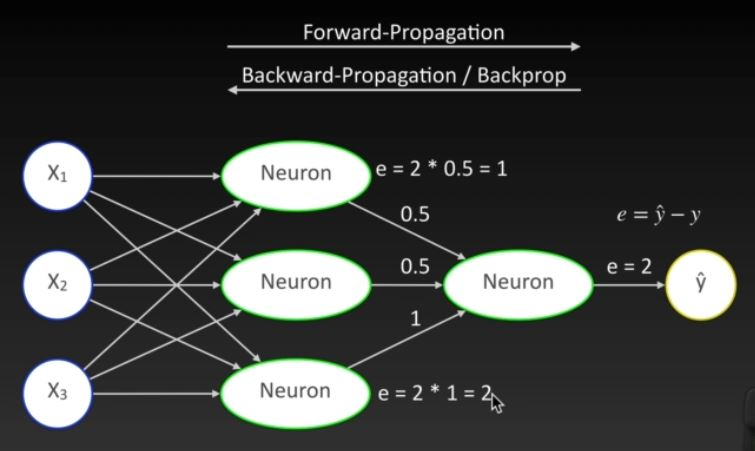

# Neuronale Netze (ein einzelnes Neuron)

## Einführung: Neuronale Netze

- Deep Lerning beschreibt Machine Learning mit neuronalen Netzen
- Es ist aber weiterhin Machine Learning
  - Daten => Modell => Vorhersagen! (meist mit komplexeren Daten und Modellen)
  - Train / Test
  - Klassifizierung / Regression (meist handelt es sich aber um Klassifizierungsprobleme)
  - Overfitting / Underfitting ist auch hier ein Problem

Welches Tool?
- Sklearn **nicht**
  - Bietet eine einfache Implementierung für Neuronale Netze
  - Diese unterstützt aber viele Features nicht (z.B. CNN - Convolutional neuronal networks für die Bilderkennung sind in sklearn nicht implementiert)
  - keine GPU-Unterstützung (für komplexe Netzwerke)
- Tensorflow / Keras
  - Quasi der Standard für Neuronale Netze & Deep Learning
  - Unterstützt alle wesentlichen Features


Was sind Neuronale Netze?

Analogie mit Nervenzellen:<br>


Analogie ist wahrscheinlich nicht ganz richtig. NN ist viel angewandte Mathematik.

Mathematik:<br>


entspricht der linearen Regression, aber in einer etwas anderen Schreibweise

Eingabeknoten (X1, X2, X3) mit Gewichten (w1, w2, w3) versehen, zusätzlich mit einem Bias-Knoten (b) versehen.
Das Neuron macht nichts anderes als die Summe (entspricht der Ausgabe y) zu berechnen.<br>
Man versucht die Gewichte und das Bias zu optimieren, damit das Neuron die entsprechende Vorhersage macht

## Wie lernt ein einzelnes Neuron

- Die idealen Gewichte vom Neuron können in einem Neuronalen Netz nicht direkt durch eine mathematische Formel ermittelt werden
- Wir müssen uns ihnen daher Schritt für Schritt annähern
- Idee:
  - Wir initialisieren die Gewichte zufällig
  - Wir schauen uns dann die Datensätze einzeln an
  - Und dann verändern wir die Gewichte ein wenig in die "richtige Richtung"


z.B. ein Neuron, welches gerade als Vorhersage gerade die 2 liefert, in Wirklichkeit hätten wir bei den Daten aber eine 6
stehen. Man kann jetzt an den Gewichten (w1, w2, w3 und b) drehen um die Vorhersage näher an die 6 zu bringen. Dieses drehen
muss ntürlich relativ oft geschehen. Man nähert sich also relativ langsam an den wirklichen Wert an. Es kann aber auch sein,
dass man die Gewichte in die andere Richtung drehen muss. Die Gewichte hängen auch von den Eingabewerten ab.

## Ein einzelnes Neuron

```python

```

```python
# Matplotlib config
%matplotlib inline
%config InlineBackend.figure_formats = ['svg']
%config InlineBackend.rc = {'figure.figsize': (5.0, 3.0)}

import numpy as np
import pandas as pd
import seaborn as sns

# Tensorflow laden
import tensorflow as tf
from tensorflow import keras
from tensorflow.keras import layers
```

Wir verwenden wieder die Daten von Diamanten
```python
df = pd.read_csv("../data/Diamonds/diamonds.csv.bz2")

df.head()
```

Ziel ist wieder auf Basis des Gewichts den Preis der Diamanten vorherzusagen.

Basis ist ein einfaches sequentielles Modell mit einer einzigen Ebene mit einem einzigen Knoten (ein Neuron)

```python
model = keras.Sequential([
    layers.Dense(1, name = "neuron")
])

# Testen mit 2 Datensätzen
v = tf.Variable([
    [1],
    [3]
])

#print(v)
#print(v.numpy())
print(model(v))

tf.Tensor(
[[1.3962232]
 [4.1886697]], shape=(2, 1), dtype=float32)
```

Jedesmal wenn diese Berechnung angestoßen wird kommen andere Werte heraus -> liegt an der zufälligen Initialisierung
der Startwerte.

Bei einem Aufruf mit mehreren Eingabespalten würden wir einen InvalidArgumentError bekommen
```python
v2 = tf.Variable([
    [1, 3],
    [3, 7]
])

print(model(v2))

InvalidArgumentError                      Traceback (most recent call last)
<ipython-input-38-00ff387867e8> in <module>
      4 ])
      5 
----> 6 print(model(v2))
...
```

Das Modell merkt sich beim ersten mal Starten wie viele Eingangsparameter verwendet wurden.<br>
Falls man das Modell jetzt nochmals neu initialisiert und mit 2 Eingangsparamatern testet funktioniert dies.

```python
model = keras.Sequential([
    layers.Dense(1, name = "neuron")
])

# Testen mit 2 Datensätzen mit jeweils 2 Paramatern
v2 = tf.Variable([
    [1, 3],
    [3, 7]
])

print(model(v2))

tf.Tensor(
[[3.6744065]
 [8.290762]], shape=(2, 1), dtype=float32)
```

Zusammengefasst:<br>
Das einzelne Neuron wird durch das Model erzeugt und die Anzahl der Eingabedaten wird beim ersten Starten mit Eingabewerten bestimmt.

## Neuron trainieren

Zuerst die X und y-Daten vorbereiten
```python
X = df[["carat"]]
y = df["price"]
```

Mit model.weights erhält man die Gewichte
```python
print(model.weights)
```

Damit das Model die Gewichte lernt und nicht nur zufällig initialisiert, muss das Model compiliert werden
```python
model.compile(
    optimizer = keras.optimizers.RMSprop(),
    loss = keras.losses.MeanSquaredError()
)
```

Bevor wir das Model fitten können müssen noch die X-Daten auf float32 umgewandelt werden.<br>
Wir sehen uns mal die X-Daten an
```python
#print(X)
#print(X.to_numpy())
print(X.to_numpy().dtype)

float64
```

Neuronales Netz will mit float32 rechnen -> schneller<br>
Das folgende fitten dauert einige Zeit
```python
model.fit(X.astype(np.float32), y, batch_size = 1, epochs = 1)

53940/53940 [==============================] - 56s 1ms/step - loss: 30607938.0000
<tensorflow.psython.kera.callbacks.History at 0x7fd784452590>
```

Danach kann man wieder ein predict durchführen
```python
model.predict(np.array([
    [0.1]
]))

array([[74.41793]], dtype=float32)
```

Das einzelne Neuron hat zwar gelernt, aber noch nicht so richtig gut:
- bis jetzt nur über eine Epoche trainiert (wir legen dem Neuron alle Daten vor und drehen dann
  an den Gewichten - dieses ansehen der Daten und drehen der Gewichte sollte mehrfach erfolgen) --> epochs-Paramter ändern
  ```python
  model.fit(X.astype(np.float32), y, batch_size = 1, epochs = 10)
  ```
  dauert sehr lange, ist also relativ ineffizient
- Änderung der batch_size --> es werden dann viele Ergebnisse auf einmal berechnet und dann nur einmal an den Gewichten gedreht
  (sollte auch von den Prozessoren - Paraellelverarbeitung - unterstützt werden) --> geht dann viel schneller
  ```python
  model.fit(X.astype(np.float32), y, batch_size = 64, epochs = 10)
  ```

Dieses neuronale Netz macht aber noch immer keine guten Vorhersagen - der berechnete **loss** über den MeanSquareError (auch in der Ausgabe)
ändert sich nicht sehr. D.h. wir drehen nur sehr schwach an unseren Geichten, d.h. wir bräuchten sehr, sehr viele Epochen um den Fehler auszugleichen.<br>
Dafür gibt es die Lernrate (gibt an wie stark wir an den Gewichten drehen sollen) - kann über den optimizer als Parameter beeinflusst werden. 
```python
model.compile(
    optimizer = keras.optimizers.RMSprop(learning_rate=0.5),
    loss = keras.losses.MeanSquaredError()
)

model.fit(X.astype(np.float32), y, batch_size = 64, epochs = 10)

model.predict(np.array([
    [0.7]
]))
```
Bei zu großer Learning-Rate (z.B. 100) ergibt sich auch kein gutes loss-Verhalten

Ausgabe des Bestimmtheitsmaß:
```python
from sklearn.metrics import r2_score

y_pred = model.predict(X.astype(np.float32))

print(r2_score(y, y_pred))

0.8493171091838858
```

## Die Aktivierungsfunktion

Idee ist ähnlich der logistischen Regression:
- Damit das Neuron eine Ausgabe zwischen 0 und 1 ausgibt, wird die Ausgabe durch eine Aktivierungsfunktion geleitet
- Dadurch können wir eine Klassifizierung durchführen (ja/nein Anwort)
- Dies wird aber später auch noch wichtig sein, um mehrere Neuronen hintereinander schalten zu können ("Neuronales Netz") - dort zwingend notwendig


- Unser Neuron führt jetzt eine Klassifizierung durch (Ja/Nein)
- Aber:
  - Das Trainieren würde so noch recht lange dauern / nicht richtig funktionieren
  - Wir benötigen noch eine andere Loss-Funktion!
  - die sogenannte BinaryCrossentropy!

Aktivierungsfunktion im Code mit Diabetesdaten:

```python
# Matplotlib config
%matplotlib inline
%config InlineBackend.figure_formats = ['svg']
%config InlineBackend.rc = {'figure.figsize': (5.0, 3.0)}

import numpy as np
import pandas as pd
import seaborn as sns

df = pd.read_csv("../data/Diabetes/diabetes.csv")
df.head()
```

Auf Basis des BMI und des Alters möchte man die Wahrscheinlichkeit (Outcome) für Diabetes schätzen
```python
X = df[["BMI", "Age"]]
y = df["Outcome"]
```

Man könnte auch noch train_test_split ausführen - hier nicht<br>
Wichtig ist der activation-Parameter in layers.Dense auf sigmoid zu setzen (standardmäßig auf linear)
```python
# Tensorflow laden
import tensorflow as tf
from tensorflow import keras
from tensorflow.keras import layers

model = keras.Sequential([
    layers.Dense(1, name = "neuron", activation = "sigmoid")
])

model.compile(
    optimizer = keras.optimizers.RMSprop(0.01),
    loss = keras.losses.BinaryCrossentropy()
)

model.fit(X.astype(np.float32), y, batch_size = 64, epochs = 100)
```
```python
model.predict(X)
```
Umwandlung in True/False-Werte (Wahrscheinlichkeiten > 0.5

```python
#(model.predict(X) > 0.5).shape
#y.to_numpy().shape
#(model.predict(X) > 0.5).ravel().shape
# reshape(-1) entspricht dem ravel()
#(model.predict(X) > 0.5).reshape(-1).shape

np.mean((model.predict(X) > 0.5).ravel() == y)

0.6627604166666666  --> entspricht einer Genauigkeit von 66%
```

```python
model.predict(np.array([
    [25, 30]
]))

array([[0.24642956]], dtype=float32)
```

# Neuronale Netze (vom Neuron zum Netz)

## Vom Neuron zum Netz (Backpropagation)

- Idee:
  - Wir "schieben" eine Schicht von Neuronen zwischen die Eingabe und unseren Ausgabe-Knoten
  - Hierbei sind alle Knoten der neuen Schicht mit allen Knoten der vorherigen Schicht verbunden
- Hierbei wir unterschieden:
  - Input-Layer
  - Hidden-Layer
  - Output-Layer
 


Das obige Bild enthält die Eingabeschicht mit den Xi-Werten, die Ausgabeschicht mit einem
Neuron und einen Hidden-Layer mit 3 Neuronen. Jedes Neuron ist mit der vorherigen Schicht komplett
verbunden. Mit einem entsprechend großen Hidden-Layer kann man jeglich komplexe Aufgabestellungen
(z.B. Bilderkennungen) lösen.

- Problem
  - Aber wie lernen wir jetzt die Gewichte?
  - Hier kommt jetzt "Deep Learning" ins Spiel... wie lernt jetzt unser Hidden-Layer?
  - Idee:
    - Backpropagation
    - Wir führen den Fehler der Neuronen des Hidden-Layers auf den Ausgabefehler zurück
   
Vorgangsweise:
- Zuerst werden die Gewichte zufällige gewählt
- danach führen wir eine "Forward-Propagation" (alle Multiplikationen und Aktivierungsfunktionen) aus
- daraus ergibt sich ein Fehler (e = y_dach - y)
- mit Hilfe des Fehlers berechnen wir wieder die Gewichte (Backward-Propagation / Backprop)



## Vom Neuron zum Netz

```python
# Matplotlib config
%matplotlib inline
%config InlineBackend.figure_formats = ['svg']
%config InlineBackend.rc = {'figure.figsize': (5.0, 3.0)}

import numpy as np
import pandas as pd
import seaborn as sns

df = pd.read_csv("../data/Diabetes/diabetes.csv")
df.head()
```

```python
# Tensorflow laden
import tensorflow as tf
from tensorflow import keras
from tensorflow.keras import layers

model = keras.Sequential([
    layers.Dense(3, name = "hidden", activation = "sigmoid"),
    layers.Dense(1, name = "neuron", activation = "sigmoid")
])

model.compile(
    optimizer = keras.optimizers.RMSprop(0.01),
    loss = keras.losses.BinaryCrossentropy()
)

model.fit(X.astype(np.float32), y, batch_size = 64, epochs = 3)
```

```python
print(model.summary())
```

Um die model.summary()-Information schon nach der model-Bildung ausgeben zu können, kann man noch einen
zusätzlichen Parameter erweitern.
```python
# Tensorflow laden
import tensorflow as tf
from tensorflow import keras
from tensorflow.keras import layers

model = keras.Sequential([
    keras.Input(shape = (2,)),
    # layers.Dense(3, name = "hidden", activation = "sigmoid", input_shape = (2,)),
    layers.Dense(3, name = "hidden", activation = "sigmoid"),
    layers.Dense(1, name = "neuron", activation = "sigmoid")
])

print(model.summary())
```
```python
model.compile(
    optimizer = keras.optimizers.RMSprop(0.01),
    loss = keras.losses.BinaryCrossentropy()
)

model.fit(X.astype(np.float32), y, batch_size = 64, epochs = 50)
```
```python
np.mean((model.predict(X) > 0.5).ravel() == y)

0.6692708333333334
```

Man kann aber auch mit viel mehr Hidden-Layer-Neuronen (z.B. 1024) arbeiten
```python
# Tensorflow laden
import tensorflow as tf
from tensorflow import keras
from tensorflow.keras import layers

model = keras.Sequential([
    keras.Input(shape = (2,)),
    layers.Dense(1024, name = "hidden", activation = "sigmoid"),
    layers.Dense(1, name = "neuron", activation = "sigmoid")
])

print(model.summary())
```

## Warum Aktivierungsfunktion

Die folgenden Codebeispiele sollen zeigen warum ist es so wichtig, dess der Hidden-Layer eine Aktivierungsfunktion enthält.

```python
# X => Neuron 1 => Neuron 2 => Ausgabe
X = 4
X * 4 * 2

32
```

```python
# X => Neuron 1 => Ausgabe
X = 4
X * 8

32
```

```python
def S(x):
    return 1 / (1 + np.exp(-x))
```

```python
# X => Neuron 1 (linear) => Neuron 2 (sigmoid) => Ausgabe
X = 4
S(X * 4 * 2)

0.9999999999999873
```

```python
# X => Neuron 1 (sigmoid) => Ausgabe
X = 4
S(X * 8)

0.9999999999999873
```

```python
# X => Neuron 1 (sigmoid) => Neuron 2 (sigmoid) => Ausgabe
X = 4
S(S(X * 4) * 2)

0.8807970543469401
```

## Die RELU-Aktivierungsfunktion

Bis jetzt wurde im Hidden-Layer eine sigmoid-Aktivierungsfunktion verwendet. Es gibt
aber auch noch andere Aktivierungsfunktionen

```python
# Matplotlib config
%matplotlib inline
%config InlineBackend.figure_formats = ['svg']
%config InlineBackend.rc = {'figure.figsize': (5.0, 3.0)}

import numpy as np
import pandas as pd
import seaborn as sns

# Aktivierungsfunktion: sigmoid
def S(x):
    return 1 / (1 + np.exp(-x))

def relu(x):
    return np.maximum(0, x)
```

Die sigmoid-Aktivierungsfunktion hat die Eigenschaft immer Werte zwischen 0 und 1 zu liefern.
Dies ist für den Ausgabelayer bei dem Beispiel mit der Diabeteserkennung für den Ausgabelayer gewünscht.<br>
Für den Hidden-Layer brauchen wir diese Eigenschaft nicht

```python
xs = np.arange(-5, 5, 0.1)
ys = S(xs)

sns.lineplot(x = xs, y = ys);
```


Das Problem bei der Sigmoid-Funktion ist auch, dass man das komplette ausschalten eines Neurons nicht
möglich ist. Weiters ist die Sigmoid-Funktion an den Enden sehr, sehr flach -> dadurch ist die Lernrate sehr gering

Was will man normalerweise mit den Hidden-Layer --> primär soll dadurch die Linearität gebrochen werden.<br>
Dies kann man schon durch die einfach RELU-Funktion erreichen (im Positiven eine lineare Funktion, im negative Null)

```python
xs = np.arange(-5, 5, 0.1)
ys = relu(xs)

sns.lineplot(x = xs, y = ys);
```


Z.B. könnte sich dadurch ein Neuron, welches bei jungen Personen negative Werte gelernt hat, komplett ausschalten. Oder
ein Neuron, welches einen niedrigen BMI liefert auch entsprechend ausschalten

## RELU anwenden

Wir verwenden wieder die Diabetesdaten, nehmen aber mehr Spalten auf.

```python
df = pd.read_csv("../data/Diabetes/diabetes.csv")

X = df[["BMI", "Age", "Glucose", "BloodPressure", "SkinThickness", "Insulin"]]
y = df["Outcome"]
```

Das Modell hat jetzt 6 Eingabedaten mit einer "relu"-Aktivierungsfunktion im Hidden-Layer und z.B. 128 Neuronen<br>
Tendentiell liefert die relu-Funktion bessere Ergebnisse als die sigmoid-Funktion im Hidden-Layer

```python
# Tensorflow laden
import tensorflow as tf
from tensorflow import keras
from tensorflow.keras import layers

model = keras.Sequential([
    keras.Input(shape = (6,)),
    layers.Dense(128, name = "hidden1", activation = "relu"),
    layers.Dense(1, name = "neuron", activation = "sigmoid")
])

print(model.summary())

Model: "sequential"
_________________________________________________________________
 Layer (type)                Output Shape              Param #   
=================================================================
 hidden1 (Dense)             (None, 128)               896                                                                       
 neuron (Dense)              (None, 1)                 129                                                                       
=================================================================
Total params: 1025 (4.00 KB)
Trainable params: 1025 (4.00 KB)
Non-trainable params: 0 (0.00 Byte)
_________________________________________________________________
None
```

Jetzt trainieren wir das Modell mit den Daten (auf den loss achten

```python
model.compile(
    optimizer = keras.optimizers.RMSprop(0.01),
    loss = keras.losses.BinaryCrossentropy()
)

model.fit(X.astype(np.float32), y, batch_size = 64, epochs = 100)
```

```python
np.mean((model.predict(X) > 0.5).ravel() == y)

0.7408854166666666
```

Eventuell mit der sigmoid-Aktivierungsfunktion im Hidden-Layer testen und vergleichen!!!

## Die MNIST-Daten

Die Stärken eines Neuronalen-Netzwerks liegen oft bei komplexen Daten (z.B. Bilderkennung) 

Im folgenden werden wir mit Hilfe der MNIST-Daten eine Ziffernerkennung entwicken.

```python
# Matplotlib config
%matplotlib inline
%config InlineBackend.figure_formats = ['svg']
%config InlineBackend.rc = {'figure.figsize': (5.0, 3.0)}

import numpy as np
import pandas as pd
import seaborn as sns

import gzip
import numpy as np

# Code aufbauend auf: https://stackoverflow.com/a/62781370
def load_images(path):
    with gzip.open(path, 'r') as f:
        # first 4 bytes is a magic number
        magic_number = int.from_bytes(f.read(4), 'big')
        # second 4 bytes is the number of images
        image_count = int.from_bytes(f.read(4), 'big')
        # third 4 bytes is the row count
        row_count = int.from_bytes(f.read(4), 'big')
        # fourth 4 bytes is the column count
        column_count = int.from_bytes(f.read(4), 'big')
        # rest is the image pixel data, each pixel is stored as an unsigned byte
        # pixel values are 0 to 255
        image_data = f.read()
        images = np.frombuffer(image_data, dtype=np.uint8)\
            .reshape((image_count, row_count, column_count))
        return images
    
def load_labels(path):
    with gzip.open(path, 'r') as f:
        # first 4 bytes is a magic number
        magic_number = int.from_bytes(f.read(4), 'big')
        # second 4 bytes is the number of labels
        label_count = int.from_bytes(f.read(4), 'big')
        # rest is the label data, each label is stored as unsigned byte
        # label values are 0 to 9
        label_data = f.read()
        labels = np.frombuffer(label_data, dtype=np.uint8)
        return labels

X_train = load_images("data/MNIST/train-images-idx3-ubyte.gz")
y_train = load_labels("data/MNIST/train-labels-idx1-ubyte.gz")

X_test = load_images("data/MNIST/t10k-images-idx3-ubyte.gz")
y_test = load_labels("data/MNIST/t10k-labels-idx1-ubyte.gz")
```

```python
print(X_train.shape)
(60000, 28, 28)

print(X_train[0, :, :])
```

Visualisieren der Daten mithilfe von matplotlib


```python
import matplotlib.pyplot as plt

plt.imshow(X_train[0, :, :])
plt.show()
```

Aufbau der Y-daten
```python
print(Y_train.shape)
(60000,)

print(Y_train[0])
5
```

Die Bilder sind als Graustufen gespeichert (werden in matplotlib aber färbig dargestellt)
